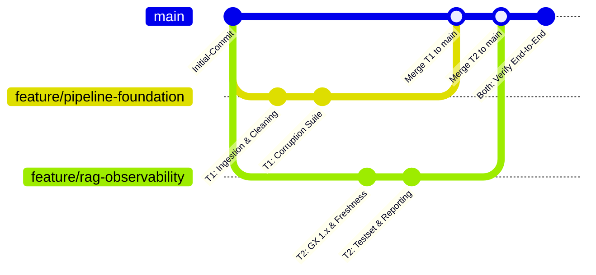

# 🤝 HƯỚNG DẪN TÍCH HỢP & QUY TRÌNH HỢP NHẤT (INTEGRATION & MERGE GUIDE)
## DÀNH CHO NHÓM 2 THÀNH VIÊN — DAY 10: DATA PIPELINE & DATA OBSERVABILITY

> **Áp dụng cho:** Nhóm 2 kỹ sư thực hiện bài Lab Day 10  
> **Thành viên 1:** Pipeline Lead & Data Foundation Owner (Nhánh `feature/pipeline-foundation`)  
> **Thành viên 2:** RAG Specialist & Observability & Evaluation Lead (Nhánh `feature/rag-observability`)  
> **Nhánh đích hợp nhất:** `main` (Bắt buộc 100% thành viên phải có commit trên nhánh này để được tính điểm!)

---

## 🗺️ 1. MA TRẬN PHÂN CÔNG & GIAO DIỆN HỢP TÁC (INTERFACE CONTRACT)

Hai thành viên làm việc độc lập trên 2 nhánh Git riêng biệt, phân chia trách nhiệm rõ ràng theo bảng dưới đây:

| Hạng mục / Module | Thành viên phụ trách chính | Đầu vào (Input) | Đầu ra bàn giao (Output) | Tệp tin đảm nhiệm |
| :--- | :--- | :--- | :--- | :--- |
| **Raw Ingestion & Preservation** | **Thành viên 1** | Crossref REST API / Snapshot local | `data/raw/crossref_records.json` | `src/ingestion/crossref.py` |
| **Data Cleaning & Pre-embed** | **Thành viên 1** | `list[PaperRecord]` | `data/clean/papers_clean.csv`, `papers_clean.json` | `src/ingestion/cleaning.py` |
| **Quality Gate & Freshness SLA** | **Thành viên 2** | `clean_df` | `baseline_quality_report.json`, `freshness_report.json` | `src/observability/quality.py` |
| **Benchmark Test Set** | **Thành viên 2** | `clean_df` | `data/eval/test_set.json` (10 câu qua 4 nhóm) | `src/evaluation/testset.py` |
| **Vector Store Indexing** | **Thành viên 2** | `clean_df`, `settings` | 3 Chroma Collections (`papers-baseline`, `papers-corrupted`, `papers-repaired`) | `src/retrieval/index.py` |
| **Baseline Pipeline (Phase 1)** | **Thành viên 1** (Tích hợp) | Tất cả các module trên | `baseline_metrics.json`, `phase1_report.md` | `src/pipelines/phase1.py`, `script/run_phase1.py` |
| **Synthetic Data Corruption** | **Thành viên 1** | `clean_df` | `papers_clean_corrupted.csv`, `corruption_log.json` | `src/ingestion/corruption.py` |
| **Corrupted Benchmark & Alarm**| **Thành viên 2** | `corrupted_df` | `corrupted_metrics.json`, `corrupted_quality_report.json` | `src/evaluation/metrics.py`, `src/observability/quality.py` |
| **Idempotent Repair Flow** | **Thành viên 1** | `raw_records.json` | `papers_clean_repaired.csv`, `repaired_metrics.json` | `src/pipelines/corruption_flow.py` |
| **Báo cáo đối chiếu 3 trạng thái**| **Thành viên 2** | Metrics 3 pha | `data/reports/corruption_report.md` (Bảng 3 cột) | `src/observability/reporting.py` |

---

## 📜 2. BẢN HỢP ĐỒNG DỮ LIỆU CHUẨN (DATA CONTRACT)

Để cả 2 thành viên không phải chờ đợi nhau, toàn bộ hệ thống thống nhất tuân thủ cấu trúc dữ liệu DataFrame chuẩn hóa sau đây:

### Schema DataFrame chuẩn (`papers_clean.csv` / `papers_clean.json`):
```text
Cột                | Kiểu dữ liệu | Ràng buộc / Mô tả
-------------------|--------------|----------------------------------------------------
paper_id           | str          | Khóa chính duy nhất (DOI), Not Null, Unique
title              | str          | Tiêu đề bài báo, Not Null, Độ dài >= 8 ký tự
summary            | str          | Tóm tắt (đã loại bỏ XML tag), Not Null, Độ dài >= 30
authors            | list[str]    | Danh sách tên tác giả
authors_joined     | str          | Chuỗi ghép tên tác giả cách nhau bởi dấu phẩy ", "
categories         | list[str]    | Danh sách chuyên ngành
categories_joined  | str          | Chuỗi ghép chuyên ngành cách nhau bởi dấu phẩy ", "
primary_category   | str          | Chuyên ngành chính
published          | str          | Ngày xuất bản chuẩn ISO YYYY-MM-DD
updated            | str          | Ngày cập nhật ISO YYYY-MM-DD
age_days           | int          | Tuổi dữ liệu tính theo ngày: (run_date - published).days
summary_chars      | int          | Độ dài chuỗi summary (len(summary))
text_for_embedding | str          | Chuỗi ngữ cảnh đầy đủ 5 phần để sinh vector nhúng
abs_url            | str          | Đường link tóm tắt bài báo
pdf_url            | str          | Đường link PDF bài báo
comment            | str          | Ghi chú dòng dữ liệu
```

### Định dạng chuẩn của cột `text_for_embedding`:
```text
Title: <title>
Authors: <authors_joined>
Published: <published>
Categories: <categories_joined>
Summary: <summary>
```

---

## 🔀 3. QUY TRÌNH PHỐI HỢP GIT ĐỘC LẬP & HỢP NHẤT AN TOÀN

Để đảm bảo không bị xung đột code (Merge Conflict) và **100% thành viên xuất hiện trên biểu đồ GitHub Contributors (Bắt buộc theo Rubric)**:



### Bước 1: Khởi tạo các nhánh làm việc riêng
- **Thành viên 1:**
  ```bash
  git checkout -b feature/pipeline-foundation
  ```
- **Thành viên 2:**
  ```bash
  git checkout -b feature/rag-observability
  ```

### Bước 2: Commit mã nguồn trên từng nhánh
- Mỗi thành viên làm việc độc lập trên module của mình, commit thường xuyên với commit message chuẩn Conventional Commits:
  - Thành viên 1: `feat(ingestion): implement crossref parsing and clean dataframe`
  - Thành viên 2: `feat(observability): implement GX 1.x ephemeral quality checks and freshness SLA`

### Bước 3: Hợp nhất (Merge) lần lượt vào nhánh `main`
Khi cả 2 đã hoàn thành các unit test cá nhân:
1. **Hợp nhất nhánh Thành viên 1 trước:**
   ```bash
   git checkout main
   git pull origin main
   git merge feature/pipeline-foundation
   git push origin main
   ```
2. **Hợp nhất nhánh Thành viên 2:**
   ```bash
   git checkout feature/rag-observability
   git rebase main   # hoặc git merge main để đồng bộ các file mới từ Thành viên 1
   git checkout main
   git merge feature/rag-observability
   git push origin main
   ```

---

## 🧪 4. KIỂM THỬ TÍCH HỢP END-TO-END (INTEGRATION VALIDATION)

Sau khi hợp nhất toàn bộ mã nguồn vào nhánh `main`, cả nhóm cùng nhau chạy 2 lệnh nghiệm thu tối cao của bài lab:

### 1. Kiểm thử Baseline Pipeline (Phase 1):
```powershell
python script/run_phase1.py
```
> **Dấu hiệu thành công:**
> - [x] Tạo ra `data/clean/papers_clean.csv` (đầy đủ 24 dòng sạch).
> - [x] ChromaDB nạp collection `papers-baseline`.
> - [x] Great Expectations 1.x trả về `success = True`.
> - [x] Freshness SLA trả về `is_fresh = True`.
> - [x] Sinh ra file `data/eval/test_set.json` (đủ 10 câu hỏi).
> - [x] Sinh ra file `data/results/baseline_metrics.json` (Hit Rate >= 0.8, Token F1 cao).
> - [x] Sinh ra file báo cáo Markdown `data/reports/phase1_report.md`.

### 2. Kiểm thử Tiêm Lỗi, Phục Hồi & Đối Chiếu 3 Trạng Thái (Phase 2):
```powershell
python script/run_corruption_flow.py
```
> **Dấu hiệu thành công:**
> - [x] File `data/results/corruption_log.json` ghi nhận đủ 6 loại lỗi.
> - [x] Great Expectations trên data lỗi báo động `success = False`.
> - [x] Freshness SLA trên data lỗi cảnh báo `is_fresh = False`.
> - [x] File `corrupted_metrics.json` chứng minh điểm số Hit Rate và F1 sụt giảm mạnh.
> - [x] Luồng Idempotent Repair tự động tái tạo dữ liệu chuẩn từ Raw.
> - [x] Great Expectations và Freshness sau phục hồi đều chuyển lại `success = True` và `is_fresh = True`.
> - [x] File `repaired_metrics.json` chứng minh điểm số phục hồi trở lại mức Baseline.
> - [x] File báo cáo Markdown `data/reports/corruption_report.md` xuất hiện với bảng đối chiếu định lượng 3 cột rõ ràng.

---

## 🎤 5. KỊCH BẢN THUYẾT TRÌNH LIVE DEMO TRÊN BẢNG (CHECKPOINT 6: 3-5 PHÚT)

Khi Giảng viên gọi nhóm lên bảng trình diễn:
1. **Mở đầu (30s - Thành viên 1):**
   - Giới thiệu tên nhóm và bài toán: Nguy cơ **Silent Failure** trong RAG — dữ liệu bị hỏng nhưng AI vẫn trả lời tự tin một cách sai lệch.
2. **Demo Tiêm Lỗi & Chốt Kiểm Dịch (90s - Thành viên 2):**
   - Mở file `data/results/corruption_log.json` chỉ ra 6 dạng lỗi đã tiêm.
   - Trình chiếu kết quả Great Expectations 1.x: Chốt chặn bắt được ngay lỗi `missing title`, `null embedding` và cảnh báo `Freshness SLA` khi ngày xuất bản bị lùi quá 180 ngày.
   - Mở `corrupted_metrics.json` so sánh với `baseline_metrics.json`: Điểm Hit Rate và Token F1 rớt thảm hại.
3. **Demo Tự Phục Hồi Idempotent Repair (60s - Thành viên 1):**
   - Trình diễn lệnh chạy `run_corruption_flow.py`.
   - Giải thích nguyên lý Idempotent: Dữ liệu sạch được tái lập từ bản lưu thô nguyên cội (`crossref_records.json`), chạy bao nhiêu lần vẫn cho một kết quả duy nhất.
4. **Kết luận & Bảng Đối Chiếu (30s - Cả 2 thành viên):**
   - Chiếu file `data/reports/corruption_report.md` với bảng ma trận 3 trạng thái.
   - Sẵn sàng trả lời câu hỏi chất vấn từ Giảng viên/Mentor.

---

## 📋 6. CHECKLIST NỘP BÀI TRÊN VLEARN LMS TRƯỚC 23:59:59

- [ ] Cả 2 lệnh `python script/run_phase1.py` và `python script/run_corruption_flow.py` chạy exit code 0.
- [ ] Điền thông tin nhóm và phần tự khai của cả 2 thành viên vào [`docs/TEAM.md`](file:///f:/Personal_project/VinLab1/K4-L3A-Day10-T086/docs/TEAM.md).
- [ ] Tạo 2 file báo cáo cá nhân:
  - `report/<MSSV1>_<HoTen1>.md` (theo mẫu `report/individual_report.md`)
  - `report/<MSSV2>_<HoTen2>.md` (theo mẫu `report/individual_report.md`)
- [ ] Hoàn thiện báo cáo nhóm `report/group_report.md`.
- [ ] Kiểm tra tab **Insights > Contributors** trên GitHub: **Bắt buộc cả 2 thành viên đều xuất hiện!**
- [ ] Đảm bảo file `.env` đã được bỏ qua bởi `.gitignore` và không lộ API Key trong lịch sử Git.
- [ ] **MỖI THÀNH VIÊN TỰ ĐĂNG NHẬP VÀO TÀI KHOẢN VLEARN LMS CÁ NHÂN VÀ NỘP ĐƯỜNG LINK GITHUB REPOSITORY!**
