# 📋 BẢN PHÂN CÔNG NHIỆM VỤ THỰC THI — THÀNH VIÊN 1
## VAI TRÒ: PIPELINE LEAD & DATA FOUNDATION OWNER

> **Họ và tên:** `[Điền Họ và Tên Thành viên 1]`  
> **MSSV:** `[Điền MSSV]`  
> **Vai trò hợp nhất:** **Pipeline Lead** (Trưởng nhóm Điều phối Pipeline) + **Data Foundation Owner** (Chủ quản Hạ tầng & Phục hồi Dữ liệu)  
> **Nhánh Git phụ trách:** `feature/pipeline-foundation`  
> **Tài liệu phối hợp:** Đối chiếu với [`TASK_MEMBER_2_RAG_OBSERVABILITY_EVAL.md`](TASK_MEMBER_2_RAG_OBSERVABILITY_EVAL.md) và [`TASK_INTEGRATION_AND_MERGE_GUIDE.md`](TASK_INTEGRATION_AND_MERGE_GUIDE.md).

---

## 🎯 1. TỔNG QUAN VAI TRÒ & PHẠM VI SỞ HỮU (OWNERSHIP)

Là **Pipeline Lead & Data Foundation Owner**, bạn chịu trách nhiệm xây dựng "hạ tầng cung cấp nước sạch" cho hệ thống AI và bộ khung điều phối toàn bài lab. Bạn phụ trách từ khâu thu thập metadata từ bên ngoài, bảo toàn dữ liệu gốc, làm sạch chuẩn hóa, tiêm độc tố dữ liệu giả lập, thực thi cơ chế tự phục hồi an toàn (Idempotent Repair) và điều phối toàn bộ pipeline đầu-cuối.

### Danh mục File & Module sở hữu trực tiếp:
1. [`src/ingestion/crossref.py`](src/ingestion/crossref.py): Thu thập Crossref REST API, bảo toàn bản gốc (Raw Preservation), cơ chế cứu hộ Offline Fallback, phân rã `PaperRecord`.
2. [`src/ingestion/cleaning.py`](src/ingestion/cleaning.py): Tiền xử lý, bóc tách thẻ XML/HTML, tính tuổi dữ liệu `age_days`, ghép `text_for_embedding`, khử trùng lặp `paper_id`.
3. [`src/ingestion/corruption.py`](src/ingestion/corruption.py): Triển khai Synthetic Data Corruption Suite với 6 kịch bản làm bẩn dữ liệu thực tế và lưu `corruption_log.json`.
4. [`src/pipelines/phase1.py`](src/pipelines/phase1.py): Điều phối luồng Baseline Pipeline End-to-End.
5. [`src/pipelines/corruption_flow.py`](src/pipelines/corruption_flow.py): Điều phối luồng Thử thách Tiêm lỗi -> Đo lường suy giảm -> Phục hồi dữ liệu (Idempotent Repair) -> Báo cáo đối chiếu.
6. [`script/run_phase1.py`](script/run_phase1.py) & [`script/run_corruption_flow.py`](script/run_corruption_flow.py): 2 Entrypoint chính chạy thực thi.

---

## ⏱️ 2. TIẾN TRÌNH THỰC HIỆN TỪNG CHECKPOINT (TIMELINE 240 PHÚT)

```mermaid
gantt
    title Tiến trình Thành viên 1: Pipeline & Data Foundation
    dateFormat X
    axisFormat %s m
    section Checkpoints
    CP0 - Môi trường & Ingestion Raw    :0, 30
    CP1 - Data Cleaning & Schema Clean  :30, 65
    CP2 - Hỗ trợ Contract & Đồng bộ     :65, 95
    CP3 - Tích hợp Phase 1 Pipeline     :95, 120
    CP4 - Synthetic Corruption Suite    :120, 165
    CP5 - Idempotent Repair Flow        :165, 210
    CP6 - Merge Git, Live Demo & Nộp LMS :210, 240
```



---

## 🛠️ 3. HƯỚNG DẪN CHI TIẾT & ĐẶC TẢ KỸ THUẬT TỪNG MODULE

### 📍 Giai đoạn 1: CP0 — Thu Thập Dữ Liệu & Bảo Toàn Bản Gốc (`src/ingestion/crossref.py`)
- **Thời lượng:** Phút 0 – 30
- **Mục tiêu:** Kéo dữ liệu từ Crossref API hoặc nạp từ Local Snapshot khi offline, trích xuất danh sách `PaperRecord` và lưu 2 file raw artifacts.
- **Nhiệm vụ cụ thể:**
  1. Hoàn thiện hàm `parse_crossref_payload(payload: dict) -> list[PaperRecord]`:
     - Trích xuất danh sách bài viết từ `payload.get("message", {}).get("items", [])`.
     - Với mỗi bài viết:
       - `paper_id`: Lấy DOI (`item.get("DOI", "")`), chuẩn hóa strip. Nếu rỗng, bỏ qua.
       - `title`: Lấy từ `item.get("title", [])` (thường là list chuỗi, lấy phần tử đầu tiên hoặc ghép lại), loại bỏ khoảng trắng thừa.
       - `summary`: Lấy từ `item.get("abstract", "")`. Bóc tách sạch các thẻ XML/HTML như `<jats:p>`, `</jats:p>`, `<jats:sec>`, `<jats:title>`, `<b>`, `<i>` bằng regex `re.sub(r"<[^>]+>", " ", text)`.
       - `authors`: Lấy từ `item.get("author", [])`, ghép `f"{a.get('given', '')} {a.get('family', '')}".strip()`.
       - `categories`: Lấy từ `item.get("subject", [])` hoặc default `["Computer Science"]`.
       - `primary_category`: Lấy phần tử đầu tiên của categories hoặc `"General"`.
       - `published`: Lấy từ `item.get("published", {}).get("date-parts", [[]])[0]`, định dạng `YYYY-MM-DD` (nếu thiếu tháng/ngày thì bù `-01-01`).
       - `updated`: Tương tự hoặc gán bằng `published`.
       - `abs_url`: `item.get("URL", f"https://doi.org/{paper_id}")`.
       - `pdf_url`: Trích xuất từ `item.get("link", [])` có `content-type` là `application/pdf` hoặc fallback về `abs_url`.
       - `comment`: `f"Crossref record {paper_id}"`.
  2. Hoàn thiện hàm `fetch_source_records(settings: Settings) -> list[PaperRecord]`:
     - Nếu `settings.refresh_source` là `True` và có kết nối mạng:
       - Gửi request đến `https://api.crossref.org/works` với query params (`query`, `filter`, `rows=settings.max_results`).
       - Xử lý retry khi gặp status code `429` (Rate limit) hoặc `503`.
       - Ghi raw response json vào `settings.paths.raw_api_response`.
     - Nếu request thất bại hoặc `settings.refresh_source` là `False`:
       - Tự động fallback đọc file snapshot có sẵn tại `settings.paths.raw_api_response` (`data/raw/crossref_response.json`).
     - Gọi `parse_crossref_payload()` để lấy danh sách `PaperRecord`.
     - Lưu danh sách records vào `settings.paths.raw_records_json` (`data/raw/crossref_records.json`).
     - Trả về `list[PaperRecord]`.
  3. Hoàn thiện hàm `load_raw_records(path: Path) -> list[PaperRecord]`:
     - Đọc file JSON từ `path`, parse từng phần tử dict thành đối tượng `PaperRecord`.
- **Lệnh tự kiểm tra (Self-Verification):**
  ```powershell
  python -c "from core.config import load_settings; from ingestion.crossref import fetch_source_records; s=load_settings(); r=fetch_source_records(s); print(f'Tín hiệu hoàn thành: Đã tải {len(r)} bài báo')"
  ```
  *(Kết quả mong đợi: In ra `Tín hiệu hoàn thành: Đã tải 24 bài báo`)*.

---

### 📍 Giai đoạn 2: CP1 — Làm Sạch & Chuẩn Hóa Dữ Liệu (`src/ingestion/cleaning.py`)
- **Thời lượng:** Phút 30 – 65
- **Mục tiêu:** Chuyển đổi `list[PaperRecord]` thành DataFrame sạch chuẩn hóa, tính `age_days` và tạo cột văn bản tổng hợp `text_for_embedding`.
- **Nhiệm vụ cụ thể:**
  1. Hoàn thiện hàm `build_clean_dataframe(records: list[PaperRecord], run_date: datetime) -> pd.DataFrame`:
     - Tạo danh sách dicts từ records.
     - Khử trùng lặp theo `paper_id` (`drop_duplicates(subset=["paper_id"])`).
     - Chuẩn hóa text (xóa khoảng trắng thừa, normalize Unicode).
     - Parse cột `published` sang kiểu `datetime` (UTC).
     - Tính toán cột số nguyên `age_days = (run_date.date() - published_dt.date()).days`.
     - Tạo các cột phụ trợ:
       - `authors_joined`: `", ".join(authors)`
       - `categories_joined`: `", ".join(categories)`
       - `summary_chars`: Độ dài ký tự `len(summary)`
     - Tạo cột ngữ cảnh cốt lõi **`text_for_embedding`** theo định dạng 5 phần:
       ```text
       Title: {title}
       Authors: {authors_joined}
       Published: {published}
       Categories: {categories_joined}
       Summary: {summary}
       ```
     - Lọc bỏ các dòng không hợp lệ (ví dụ `summary_chars < 10` hoặc `title` rỗng).
     - Sắp xếp DataFrame theo `published` giảm dần (bài mới nhất lên đầu).
- **Lệnh tự kiểm tra (Self-Verification):**
  ```powershell
  python -c "from datetime import datetime, timezone; from core.config import load_settings; from ingestion.crossref import load_raw_records; from ingestion.cleaning import build_clean_dataframe; s=load_settings(); df=build_clean_dataframe(load_raw_records(s.paths.raw_records_json), datetime.now(timezone.utc)); print(f'Tín hiệu hoàn thành: Clean thành công {len(df)} dòng, có đủ cột text_for_embedding: {\"text_for_embedding\" in df.columns}')"
  ```
  *(Kết quả mong đợi: `Tín hiệu hoàn thành: Clean thành công 24 dòng, có đủ cột text_for_embedding: True`)*.

> 📢 **BÀN GIAO SỚM CHO THÀNH VIÊN 2:**  
> Sau khi bước này hoàn tất, hãy xuất file:
> ```python
> df.to_csv(settings.paths.clean_csv, index=False)
> df.to_json(settings.paths.clean_json, orient="records", indent=2)
> ```
> Báo cho Thành viên 2 biết file `data/clean/papers_clean.csv` đã sẵn sàng!

---

### 📍 Giai đoạn 3: CP3 — Kết Nối Baseline Pipeline End-to-End (`src/pipelines/phase1.py`)
- **Thời lượng:** Phút 95 – 120
- **Mục tiêu:** Ghép nối toàn bộ chuỗi mắt xích dữ liệu sạch, gọi các module của Thành viên 2 (`observability.quality`, `retrieval.index`, `evaluation.testset`, `evaluation.metrics`, `observability.reporting`).
- **Nhiệm vụ cụ thể:**
  1. Hoàn thiện hàm `main()` trong `src/pipelines/phase1.py`:
     ```python
     # 1. Load settings & run date
     settings = load_settings()
     run_date = datetime.now(timezone.utc)
     
     # 2. Ingestion & Raw Preservation
     records = fetch_source_records(settings)
     
     # 3. Data Cleaning
     clean_df = build_clean_dataframe(records, run_date=run_date)
     clean_df.to_csv(settings.paths.clean_csv, index=False)
     clean_df.to_json(settings.paths.clean_json, orient="records", indent=2)
     
     # 4. Data Quality Gate (GX 1.x) & Freshness SLA (Từ Thành viên 2)
     quality_result = run_data_quality_checks(clean_df, settings, report_name="baseline")
     freshness_result = build_freshness_report(clean_df, settings, settings.paths.freshness_report)
     
     # 5. ChromaDB Vector Indexing
     index = LocalEmbeddingIndex.build(clean_df, settings, settings.paths.embeddings_json)
     
     # 6. Benchmark Test Set (Từ Thành viên 2)
     test_set = build_test_set(clean_df, settings.paths.eval_testset)
     
     # 7. Evaluate Baseline
     eval_bundle = evaluate_pipeline(
         settings, index, settings.paths.eval_testset,
         settings.paths.baseline_metrics, settings.paths.baseline_answers
     )
     
     # 8. Sinh báo cáo Phase 1 Markdown (Từ Thành viên 2)
     generate_phase1_report(
         settings.paths.baseline_report,
         source_summary={"total_records": len(records), "clean_records": len(clean_df)},
         metrics=eval_bundle.summary,
         quality=quality_result,
         freshness=freshness_result
     )
     ```
- **Lệnh tự kiểm tra (Self-Verification):**
  ```powershell
  python script/run_phase1.py
  ```
  *(Kết quả mong đợi: Exit code 0, console in đủ các bước và sinh `phase1_report.md`)*.

---

### 📍 Giai đoạn 4: CP4 — Tiêm Độc Tố Dữ Liệu Thực Tế (`src/ingestion/corruption.py`)
- **Thời lượng:** Phút 120 – 165
- **Mục tiêu:** Mô phỏng 6 lỗi dữ liệu bẩn sản xuất và ghi log chi tiết vào `data/results/corruption_log.json`.
- **Nhiệm vụ cụ thể:**
  1. Hoàn thiện hàm `corrupt_clean_dataframe(df: pd.DataFrame, output_log_path) -> pd.DataFrame`:
     - Tạo bản sao `corrupted_df = df.copy()`.
     - Khởi tạo danh sách `corruption_logs = []`.
     - **Lỗi 1 (Drop latest records):** Sắp xếp theo ngày giảm dần, loại bỏ 20% bản ghi mới nhất (ví dụ 4-5 bài).
       - Ghi log: `{"type": "drop_latest_records", "count": dropped_count}`.
     - **Lỗi 2 (Blank summary):** Chọn ngẫu nhiên 2 bản ghi và đặt `summary = ""` (hoặc chuỗi rỗng).
       - Ghi log: `{"type": "blank_summary", "affected_ids": [...]}`.
     - **Lỗi 3 (Inject noise):** Chọn 2 bản ghi và chèn chuỗi rác `"[CORRUPTED NOISE %$#@! NULL_POINTER_EXCEPTION]"` vào giữa phần tóm tắt.
       - Ghi log: `{"type": "inject_noise", "affected_ids": [...]}`.
     - **Lỗi 4 (Truncate title):** Chọn 2 bản ghi và cắt ngắn tiêu đề xuống `< 8` ký tự (ví dụ `"Agent"` hoặc `"Paper"`).
       - Ghi log: `{"type": "truncate_title", "affected_ids": [...]}`.
     - **Lỗi 5 (Stale date):** Chọn 30% bản ghi và lùi ngày xuất bản về 365 ngày trước (`published_date - timedelta(days=365)`), cập nhật lại `age_days += 365` (gây vi phạm Freshness SLA!).
       - Ghi log: `{"type": "stale_date", "affected_ids": [...]}`.
     - **Lỗi 6 (Duplicate rows):** Chọn 2-3 bản ghi bất kỳ và nhân đôi (append lại vào cuối DataFrame).
       - Ghi log: `{"type": "duplicate_rows", "count": dup_count}`.
     - Cập nhật lại cột `text_for_embedding` trên DataFrame đã bị tiêm lỗi!
     - Ghi toàn bộ `corruption_logs` ra file `output_log_path` (`data/results/corruption_log.json`).
     - Trả về `corrupted_df`.
- **Lệnh tự kiểm tra (Self-Verification):**
  ```powershell
  python -c "from core.config import load_settings; from ingestion.corruption import corrupt_clean_dataframe; import pandas as pd; s=load_settings(); df=pd.read_json(s.paths.clean_json); c=corrupt_clean_dataframe(df, s.paths.corruption_log); print(f'Tín hiệu hoàn thành: Corrupted {len(c)} dòng, tồn tại log: {s.paths.corruption_log.exists()}')"
  ```
  *(Kết quả mong đợi: In ra số dòng sau corruption và `tồn tại log: True`)*.

---

### 📍 Giai đoạn 5: CP5 — Cơ Chế Tự Phục Hồi Idempotent Repair (`src/pipelines/corruption_flow.py`)
- **Thời lượng:** Phút 165 – 210
- **Mục tiêu:** Điều phối toàn bộ quy trình: Tiêm lỗi -> Đo lường sụt giảm -> Phục hồi dữ liệu từ Raw Snapshot -> Đo lường phục hồi -> Sinh báo cáo so sánh 3 trạng thái.
- **Nhiệm vụ cụ thể:**
  1. Hoàn thiện hàm `main()` trong `src/pipelines/corruption_flow.py`:
     - **Pha A (Corrupted Flow):**
       - Đọc dữ liệu sạch `clean_df` từ `settings.paths.clean_json`.
       - Chạy `corrupt_clean_dataframe` tạo `corrupted_df`.
       - Lưu `corrupted_df` vào `settings.paths.corrupted_clean_csv` và `settings.paths.corrupted_clean_json`.
       - Chạy `run_data_quality_checks` trên `corrupted_df` (Kỳ vọng: GX báo `success = False`).
       - Chạy `build_freshness_report` trên `corrupted_df` (Kỳ vọng: `is_fresh = False`).
       - Build collection ChromaDB `papers-corrupted` bằng `LocalEmbeddingIndex.build(corrupted_df, settings, settings.paths.corrupted_embeddings_json)`.
       - Chạy `evaluate_pipeline()` đo lường chỉ số bị sụt giảm, lưu `data/results/corrupted_metrics.json`.
     - **Pha B (Idempotent Repair Flow):**
       - *Nguyên lý Idempotent:* Đọc lại toàn bộ dữ liệu gốc đáng tin cậy từ `settings.paths.raw_records_json` (hoặc `raw_api_response`).
       - Chạy lại `build_clean_dataframe()` tạo `repaired_df`.
       - Lưu `repaired_df` vào `settings.paths.repaired_clean_csv` và `settings.paths.repaired_clean_json`.
       - Chạy `run_data_quality_checks` trên `repaired_df` (Kỳ vọng: GX báo `success = True`).
       - Chạy `build_freshness_report` trên `repaired_df` (Kỳ vọng: `is_fresh = True`).
       - Re-index collection ChromaDB `papers-repaired` bằng `LocalEmbeddingIndex.build(repaired_df, settings, settings.paths.repaired_embeddings_json)`.
       - Chạy `evaluate_pipeline()` chứng minh các chỉ số phục hồi về mức Baseline, lưu `data/results/repaired_metrics.json`.
     - **Pha C (Reporting):**
       - Gọi hàm của Thành viên 2 `generate_corruption_report()` để xuất bản báo cáo đối chiếu định lượng 3 cột: **Baseline vs Corrupted vs Repaired** ra `data/reports/corruption_report.md`.
- **Lệnh tự kiểm tra (Self-Verification):**
  ```powershell
  python script/run_corruption_flow.py
  ```
  *(Kết quả mong đợi: Chạy trơn tru từ đầu đến cuối, console in bảng so sánh hiệu năng 3 trạng thái)*.

---

## ✅ 4. CHECKLIST NGHIỆM THU CỦA THÀNH VIÊN 1 TRƯỚC KHI MERGE

- [ ] File `src/ingestion/crossref.py` nạp được dữ liệu từ API hoặc snapshot offline.
- [ ] File `src/ingestion/cleaning.py` sinh đúng cột `text_for_embedding` và `age_days`.
- [ ] File `src/ingestion/corruption.py` tiêm đủ 6 dạng lỗi và ghi `corruption_log.json`.
- [ ] File `src/pipelines/phase1.py` chạy thành công không lỗi cú pháp.
- [ ] File `src/pipelines/corruption_flow.py` chạy thành công cả 3 giai đoạn: Corrupted -> Repaired -> Comparison.
- [ ] Hai lệnh entrypoint chạy mượt mà:
  - `python script/run_phase1.py`
  - `python script/run_corruption_flow.py`
- [ ] Viết phần tự khai cá nhân của Thành viên 1 vào `report/<MSSV1>_HoTen.md` và `docs/TEAM.md`.
- [ ] Commit toàn bộ code với commit message rõ ràng: `feat(pipeline): implement crossref ingestion, cleaning, corruption suite and idempotent repair flows`.
