# 📋 BẢN PHÂN CÔNG NHIỆM VỤ THỰC THI — THÀNH VIÊN 2
## VAI TRÒ: RAG SPECIALIST & OBSERVABILITY & EVALUATION LEAD

> **Họ và tên:** **Nguyễn Khắc Quang**  
> **MSSV:** **2A202602885**  
> **Vai trò hợp nhất:** **RAG Specialist** (Chuyên gia Vector Store & Agent Retrieval) + **Observability & Evaluation Lead** (Trưởng nhóm Giám sát Chất lượng & Đánh giá)  
> **Nhánh Git phụ trách:** `feature/rag-observability`  
> **Tài liệu phối hợp:** Đối chiếu với [`TASK_MEMBER_1_PIPELINE_DATA_FOUNDATION.md`](TASK_MEMBER_1_PIPELINE_DATA_FOUNDATION.md) và [`TASK_INTEGRATION_AND_MERGE_GUIDE.md`](TASK_INTEGRATION_AND_MERGE_GUIDE.md).

---

## 🎯 1. TỔNG QUAN VAI TRÒ & PHẠM VI SỞ HỮU (OWNERSHIP)

Là **RAG Specialist & Observability & Evaluation Lead**, bạn đóng vai trò "Trạm kiểm dịch vệ sinh dữ liệu" và "Ban giám khảo đánh giá chất lượng AI". Sứ mệnh của bạn là:
1. Dựng chốt chặn tự động **Great Expectations 1.x** và giám sát hạn sử dụng dữ liệu (**Freshness SLA**) để ngăn chặn dữ liệu bẩn lọt vào Vector Database.
2. Quản lý kho vector đa bộ sưu tập (**ChromaDB**) và tối ưu hóa hệ thống truy vấn ngữ nghĩa (RAG QA / Agent).
3. Thiết kế bộ đề thi chuẩn hóa (**Benchmark Test Set**) 10 câu hỏi bao phủ 4 dạng bài toán.
4. Đo lường định lượng các chỉ số retrieval & answer (**Hit Rate, Token F1, LLM Judge Score**).
5. Xuất bản các báo cáo phân tích chuyên sâu định dạng Markdown (`phase1_report.md` và `corruption_report.md`) chứng minh hiện tượng **Silent Failure** và khả năng tự phục hồi của AI.

### Danh mục File & Module sở hữu trực tiếp:
1. [`src/observability/quality.py`](src/observability/quality.py): Cấu hình Great Expectations 1.x (chuẩn Ephemeral mới nhất), 4 Expectations bắt buộc, đo lường Freshness SLA.
2. [`src/observability/reporting.py`](src/observability/reporting.py): Xây dựng generator sinh báo cáo Markdown `phase1_report.md` và bảng ma trận đối chiếu 3 trạng thái `corruption_report.md`.
3. [`src/evaluation/testset.py`](src/evaluation/testset.py): Xây dựng bộ đề thi 10 câu hỏi trắc nghiệm/tự luận đa dạng (summary, authors, date, categories) kèm ground truth.
4. [`src/retrieval/index.py`](src/retrieval/index.py) & [`src/retrieval/embeddings.py`](src/retrieval/embeddings.py): Quản lý 3 Chroma collections tách biệt (`papers-baseline`, `papers-corrupted`, `papers-repaired`), MiniLM embedding, cosine similarity.
5. [`src/retrieval/agent.py`](src/retrieval/agent.py), [`src/retrieval/llm.py`](src/retrieval/llm.py), [`src/retrieval/qa.py`](src/retrieval/qa.py): Điều phối QA Agent đa nhà cung cấp LLM (Gemini / OpenAI / Anthropic / Mock).
6. [`src/evaluation/metrics.py`](src/evaluation/metrics.py): Đảm bảo các chỉ số đo lường Retrieval Hit Rate, Token F1, LLM Judge hoạt động chuẩn xác.

---

## 🚀 2. CHIẾN LƯỢC LÀM VIỆC SONG SONG (ZERO-BLOCKER CONTRACT)

> 💡 **BẠN KHÔNG CẦN CHỜ THÀNH VIÊN 1 LÀM XONG MỚI BẮT ĐẦU!**  
> Trong thư mục `data/raw/` đã có sẵn file snapshot chuẩn `data/raw/crossref_records.json`. Bạn có thể tạo ngay một mock DataFrame để viết và kiểm thử toàn bộ `quality.py`, `testset.py`, `index.py` ngay từ phút đầu tiên:
>
> ```python
> import pandas as pd
> from core.utils import read_json
> 
> # Đọc 24 records mẫu có sẵn
> records = read_json("data/raw/crossref_records.json")
> df_mock = pd.DataFrame(records)
> df_mock["authors_joined"] = df_mock["authors"].apply(lambda a: ", ".join(a) if isinstance(a, list) else str(a))
> df_mock["categories_joined"] = df_mock["categories"].apply(lambda c: ", ".join(c) if isinstance(c, list) else str(c))
> df_mock["age_days"] = 120
> df_mock["text_for_embedding"] = df_mock.apply(lambda r: f"Title: {r['title']}\nAuthors: {r['authors_joined']}\nPublished: {r['published']}\nCategories: {r['categories_joined']}\nSummary: {r['summary']}", axis=1)
> ```
> Bằng cách này, bạn và Thành viên 1 có thể chạy song song 100% không lo bị tắc nghẽn!

---

## ⏱️ 3. TIẾN TRÌNH THỰC HIỆN TỪNG CHECKPOINT (TIMELINE 240 PHÚT)

```mermaid
gantt
    title Tiến trình Thành viên 2: RAG & Observability & Evaluation
    dateFormat X
    axisFormat %s m
    section Checkpoints
    CP0 - Cấu hình LLM & Smoke Test     :0, 30
    CP1 - Great Expectations 1.x & SLA  :30, 65
    CP2 - Benchmark Test Set & ChromaDB :65, 95
    CP3 - Metrics & Phase 1 Report      :95, 120
    CP4 - Corrupted Benchmark & Alert   :120, 165
    CP5 - Repaired Benchmark & Report   :165, 210
    CP6 - Merge Git, Live Demo & Nộp LMS :210, 240
```



---

## 🛠️ 4. HƯỚNG DẪN CHI TIẾT & ĐẶC TẢ KỸ THUẬT TỪNG MODULE

### 📍 Giai đoạn 1: CP0 — Cấu Hình Môi Trường & Khởi Động RAG (`.env` & `src/retrieval/`)
- **Thời lượng:** Phút 0 – 30
- **Mục tiêu:** Kích hoạt môi trường, cấu hình API Key (`GOOGLE_API_KEY`), kiểm tra các thư viện RAG và embedding MiniLM.
- **Nhiệm vụ cụ thể:**
  1. Kiểm tra file `.env`: Đảm bảo `LLM_PROVIDER=gemini` và điền `GOOGLE_API_KEY=...` hợp lệ (nếu không có key, có thể test tạm bằng `LLM_PROVIDER=mock`).
  2. Rà soát `src/retrieval/llm.py` và `src/retrieval/embeddings.py`:
     - Mô hình embedding mặc định: `sentence-transformers/all-MiniLM-L6-v2`.
     - Đảm bảo hàm `build_llm()` khởi tạo thành công model client.
- **Lệnh tự kiểm tra (Self-Verification):**
  ```powershell
  python -c "import chromadb, great_expectations, sentence_transformers; from retrieval.embeddings import MiniLMEmbeddings; m=MiniLMEmbeddings('sentence-transformers/all-MiniLM-L6-v2'); emb=m.embed_query('test RAG'); print(f'Môi trường sẵn sàng. Dim: {len(emb)}')"
  ```
  *(Kết quả mong đợi: `Môi trường sẵn sàng. Dim: 384`)*.

---

### 📍 Giai đoạn 2: CP1 — Xây Dựng Quality Gate Great Expectations 1.x & Freshness SLA (`src/observability/quality.py`)
- **Thời lượng:** Phút 30 – 65
- **Mục tiêu:** Thiết lập trạm kiểm soát dữ liệu tự động theo chuẩn **GX 1.x Ephemeral Context** và cơ chế cảnh báo dữ liệu cũ theo Freshness SLA.
- **Nhiệm vụ cụ thể:**
  1. Hoàn thiện hàm `run_data_quality_checks(df: pd.DataFrame, settings: Settings, report_name: str) -> dict[str, Any]`:
     - ⚠️ **LƯU Ý CỰC KỲ QUAN TRỌNG:** Cú pháp cũ `context.sources.pandas_default` bị cấm vì gây crash trên GX 1.x. Sử dụng chuẩn mới:
       ```python
       import great_expectations as gx
       import great_expectations.expectations as gxe
       
       context = gx.get_context(mode="ephemeral")
       data_source = context.data_sources.add_pandas(name="papers_source")
       data_asset = data_source.add_dataframe_asset(name="papers_asset")
       batch_def = data_asset.add_batch_definition_whole_dataframe("papers_batch")
       batch = batch_def.get_batch(batch_parameters={"dataframe": df})
       ```
     - Định nghĩa **4 Expectations bắt buộc**:
       1. `ExpectTableRowCountToBeBetween(min_value=5, max_value=5000)`: Số bản ghi hợp lệ.
       2. `ExpectColumnValuesToNotBeNull`: Áp dụng cho các cột `paper_id`, `title`, `text_for_embedding`.
       3. `ExpectColumnValuesToBeUnique(column="paper_id")`: Khóa chính độc nhất, không trùng lặp.
       4. `ExpectColumnValueLengthsToBeBetween(column="summary", min_value=30)`: Tóm tắt đủ dài để hiểu nghĩa.
     - Thực thi validation suite và trích xuất kết quả:
       - `success`: Boolean (`True` nếu tất cả pass, `False` nếu có ít nhất 1 kỳ vọng fail).
       - `total_expectations`: Tổng số rules đã chạy (4-6 rules).
       - `successful_expectations`: Số rule pass.
       - `failed_expectations`: Số rule fail kèm chi tiết lỗi (column, expectation type).
     - Lưu kết quả ra file JSON tương ứng trong `settings.paths.quality_dir` (ví dụ `baseline_quality_report.json` hoặc `corrupted_quality_report.json`).
     - Trả về `dict` kết quả.
  2. Hoàn thiện hàm `build_freshness_report(df: pd.DataFrame, settings: Settings, report_path) -> dict[str, Any]`:
     - Chuyển đổi cột `published` sang datetime nếu cần.
     - Tìm ngày mới nhất `latest_published` và cũ nhất `oldest_published`.
     - Đếm số dòng bị quá hạn `stale_rows`: các dòng có `age_days > settings.freshness_threshold_days` (ngưỡng 180 ngày).
     - Tính tỷ lệ: `stale_ratio = stale_rows / len(df)`.
     - Xác định trạng thái tươi mới:
       ```python
       is_fresh = stale_ratio <= 0.25  # Báo động False nếu > 25% bài báo bị quá hạn 180 ngày!
       ```
     - Đóng gói payload:
       ```python
       payload = {
           "latest_published": str(latest_published),
           "oldest_published": str(oldest_published),
           "stale_rows": int(stale_rows),
           "total_rows": int(len(df)),
           "stale_ratio": float(stale_ratio),
           "threshold_days": settings.freshness_threshold_days,
           "is_fresh": bool(is_fresh),
       }
       ```
     - Ghi payload vào `report_path` (`freshness_report.json`) và trả về `dict`.
- **Lệnh tự kiểm tra (Self-Verification):**
  ```powershell
  python -c "from core.config import load_settings; from observability.quality import run_data_quality_checks, build_freshness_report; from core.utils import read_json; import pandas as pd; s=load_settings(); records=read_json(s.paths.raw_records_json); df=pd.DataFrame(records); df['text_for_embedding']='Sample text'; df['age_days']=10; q=run_data_quality_checks(df, s, 'test'); f=build_freshness_report(df, s, s.paths.freshness_report); print(f'Tín hiệu hoàn thành: GX success={q[\"success\"]}, is_fresh={f[\"is_fresh\"]}')"
  ```
  *(Kết quả mong đợi: `Tín hiệu hoàn thành: GX success=True, is_fresh=True`)*.

---

### 📍 Giai đoạn 3: CP2 — Xây Dựng Benchmark Test Set & Quản Lý ChromaDB (`src/evaluation/testset.py` & `src/retrieval/index.py`)
- **Thời lượng:** Phút 65 – 95
- **Mục tiêu:** Tạo bộ đề thi 10 câu hỏi bao phủ 4 taxonomy nghiệp vụ và kiểm tra khả năng nạp dữ liệu sạch vào ChromaDB collection `papers-baseline`.
- **Nhiệm vụ cụ thể:**
  1. Hoàn thiện hàm `build_test_set(df: pd.DataFrame, output_path) -> list[dict[str, Any]]`:
     - Kiểm tra `len(df) >= 4` để đảm bảo đủ dữ liệu chọn mẫu.
     - Lựa chọn 10 bài báo đại diện từ DataFrame sạch (ví dụ top 10 bài mới nhất hoặc trải đều).
     - Sinh đúng **10 câu hỏi đánh giá** phân bố đều qua **4 nhóm nghiệp vụ**:
       1. **`summary` (3 câu):**
          - Question: `f"What is the summary of the paper '{row['title']}'?"`
          - Ground truth: Câu đầu tiên của tóm tắt (`row['summary'].split('.')[0].strip() + '.'`).
          - `ground_truth_doc_ids`: `[row['paper_id']]`.
       2. **`authors` (3 câu):**
          - Question: `f"Who authored the paper '{row['title']}'?"`
          - Ground truth: `row['authors_joined']`.
          - `ground_truth_doc_ids`: `[row['paper_id']]`.
       3. **`date` (2 câu):**
          - Question: `f"When was the paper '{row['title']}' published?"`
          - Ground truth: `row['published']`.
          - `ground_truth_doc_ids`: `[row['paper_id']]`.
       4. **`categories` (2 câu):**
          - Question: `f"What categories does the paper '{row['title']}' belong to?"`
          - Ground truth: `row['categories_joined']`.
          - `ground_truth_doc_ids`: `[row['paper_id']]`.
     - Định dạng từng câu hỏi:
       ```json
       {
         "id": "eval_001",
         "question_type": "summary",
         "question": "What is the summary of the paper '...'?",
         "ground_truth": "...",
         "ground_truth_doc_ids": ["10.1145/..."]
       }
       ```
     - Lưu danh sách 10 câu hỏi vào `output_path` (`data/eval/test_set.json`).
     - Trả về `list[dict]`.
  2. Kiểm tra `LocalEmbeddingIndex` trong `src/retrieval/index.py`:
     - Đảm bảo hàm `LocalEmbeddingIndex.build(df, settings, embeddings_path)` nạp thành công 24 vector vào Chroma collection `papers-baseline`.
     - Thử nghiệm search và lookup:
       ```python
       index = LocalEmbeddingIndex.load(settings)
       results = index.search("agentic retrieval", top_k=2)
       ```
- **Lệnh tự kiểm tra (Self-Verification):**
  ```powershell
  python -c "from core.config import load_settings; from evaluation.testset import build_test_set; from core.utils import read_json; import pandas as pd; s=load_settings(); records=read_json(s.paths.raw_records_json); df=pd.DataFrame(records); df['authors_joined']=df['authors'].apply(lambda x: ', '.join(x)); df['categories_joined']=df['categories'].apply(lambda x: ', '.join(x)); ts=build_test_set(df, s.paths.eval_testset); print(f'Tín hiệu hoàn thành: Sinh được {len(ts)} câu hỏi test')"
  ```
  *(Kết quả mong đợi: `Tín hiệu hoàn thành: Sinh được 10 câu hỏi test`)*.

---

### 📍 Giai đoạn 4: CP3 & CP5 — Thiết Kế Markdown Report Generator (`src/observability/reporting.py`)
- **Thời lượng:** Phút 95 – 120 (Phase 1) & Phút 165 – 210 (Phase 2)
- **Mục tiêu:** Sinh báo cáo phân tích Baseline `phase1_report.md` và Bảng đối chiếu định lượng 3 trạng thái `corruption_report.md`.
- **Nhiệm vụ cụ thể:**
  1. Hoàn thiện hàm `generate_phase1_report(report_path, source_summary, metrics, quality, freshness)`:
     - Xuất báo cáo Markdown với các phần:
       - Header, thời gian chạy, cấu hình model (`settings.model_name`, `settings.embedding_model`).
       - Bảng thống kê Ingestion & Data Quality (Total records, Clean records, GX Pass/Fail, Freshness SLA).
       - Bảng Benchmark Metrics (Retrieval Hit Rate, Mean Token F1, LLM Judge Accuracy, Mean Judge Score).
       - Nhận định: Xác nhận baseline sẵn sàng cho serving.
     - Ghi ra `report_path` (`data/reports/phase1_report.md`).
  2. Hoàn thiện hàm `generate_corruption_report(...)`:
     - Đây là **deliverable cốt lõi** quyết định điểm số cao nhất của bài lab!
     - Xuất báo cáo Markdown chứa **Bảng Ma Trận So Sánh 3 Trạng Thái**:
       ```markdown
       | Tiêu chí đánh giá / Metric | 1. Dữ liệu Sạch (Baseline) | 2. Dữ liệu Bị Tiêm Lỗi (Corrupted) | 3. Sau Khi Phục Hồi (Repaired) | Đánh giá xu hướng |
       | :--- | :---: | :---: | :---: | :--- |
       | **Số lượng bản ghi** | 24 | 22 (hoặc x) | 24 | Phục hồi toàn vẹn |
       | **GX 1.x Quality Gate** | PASSED (True) | FAILED (False) | PASSED (True) | Chặn đứng dữ liệu lỗi |
       | **Freshness SLA (>180d)** | Tươi mới (True) | Quá hạn (False) | Tươi mới (True) | Phát hiện mốc thời gian |
       | **Retrieval Hit Rate** | 100.0% (1.00) | Giảm sút (ví dụ 0.60) | 100.0% (1.00) | Phục hồi hoàn hảo |
       | **Mean Token F1** | Cao (ví dụ 0.85) | Rớt mạnh (ví dụ 0.40) | Cao (ví dụ 0.85) | Khôi phục câu trả lời |
       | **LLM Judge Score (1-5)**| 4.8 / 5.0 | 2.1 / 5.0 | 4.8 / 5.0 | Loại bỏ Hallucination |
       ```
     - Thêm phân tích định tính chuyên sâu:
       - Phân tích hiện tượng **Silent Failure**: Khi summary bị cắt ngắn hoặc xóa, Agent vẫn trả lời rất tự tin nhưng điểm F1 và Judge rớt thảm hại vì thông tin không có trong context.
       - Phân tích cơ chế **Idempotent Repair**: Tái tạo lại từ raw snapshot đảm bảo tính nhất quán tuyệt đối, không phụ thuộc vào trạng thái lỗi trước đó.
     - Ghi ra `report_path` (`data/reports/corruption_report.md`).
- **Lệnh tự kiểm tra (Self-Verification):**
  ```powershell
  python -c "from observability.reporting import generate_phase1_report; generate_phase1_report('data/reports/test_report.md', {'clean_records': 24}, {'retrieval_hit_rate': 1.0, 'mean_token_f1': 0.85, 'judge_accuracy': 1.0, 'mean_judge_score': 5.0}, {'success': True}, {'is_fresh': True}); print('Tín hiệu hoàn thành: Report generator OK')"
  ```

---

## ✅ 5. CHECKLIST NGHIỆM THU CỦA THÀNH VIÊN 2 TRƯỚC KHI MERGE

- [x] File `src/observability/quality.py` chạy đúng chuẩn GX 1.x (không dùng cú pháp cũ gây lỗi), kiểm tra đủ 4 Expectations và Freshness SLA.
- [x] File `src/evaluation/testset.py` sinh đúng 10 câu hỏi bao phủ 4 categories: `summary`, `authors`, `date`, `categories`.
- [x] File `src/observability/reporting.py` sinh ra `phase1_report.md` và `corruption_report.md` có đầy đủ bảng ma trận 3 cột rõ ràng.
- [x] Các ChromaDB collections nạp vector chuẩn xác và trả về kết quả tìm kiếm đúng độ tương đồng cosine.
- [x] Viết phần tự khai cá nhân của Thành viên 2 vào `report/2A202602885_NguyenKhacQuang.md` và `docs/TEAM.md`.
- [x] Commit toàn bộ code với commit message rõ ràng: `feat(observability-rag): implement GX 1.x quality gate, freshness SLA, benchmark testset, and comparative reporting`.
